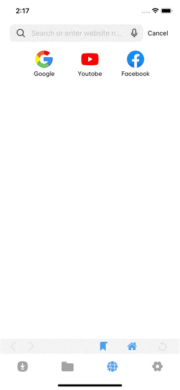

<!-- TABLE OF CONTENTS -->

  
Table of Contents

  <ol>
    <li>
      <a href="#about-the-project">About The Project</a>
    </li>
    <li><a href="#video-demo">Video Demo</a></li>
    <li><a href="#contact">Contact</a></li>
  </ol>

<!-- ABOUT THE PROJECT -->
## About The Project

This is my detail description about `Download-Files` project when i am working at my company. Because of policy and privacy, i can not attach the code to this repository. If yout want to make some features like this application, please contact me at <a href="#contact">Contact</a>. 

`Download-Files` is an application for downloading and managing files, such as images, videos, pdf,... My main role is implement `Download Controller` and `Browser Controller`.

`Download-Files` have some main features:
- Download multiple type media, such as `.jpeg, .png, .mp3, .mp4, .pdf, ...`. Filter View file types
- Browser in App: 
  - Searching and Suggestion
  - Navigate in Browser
  - Bookmark

Some frameworks and techniques:
- **Realm and FileManager**: : To save, manage and handle data.
- **DispathQueue** Fetching Data with multiple Threads.
- **UIview.animate(), CGAffineTransform()**: Enhancing user experiences.
- **URLSession**: For downloading files.
- **WKWebView and Javascript**: Get actual video mp4 link.

(<a href="#readme-top">back to top</a>)

# Video Demo

## I. Download Controller

Main Feature `Download Controller`:

- Download multiple file types: videos, images, audio and filter files types.

| Download video youtube| Download images | Filter Files |
| :--------: | :--------: | :--------: | 
|  |  |  |

## II. Browser Controller

Main Feature `Browser Controller`: Suggestion and Searching, Navigate and Bookmark 

| Suggestion and Searching | Bookmark | Navigate |
| :--------: | :--------: | :--------: |
|  |  |  | 
 

## Contact

Full Name - [Trinh Tien Viet](https://www.facebook.com/mdgarp49) - tienviet153153@gmail.com

(<a href="#readme-top">back to top</a>)

